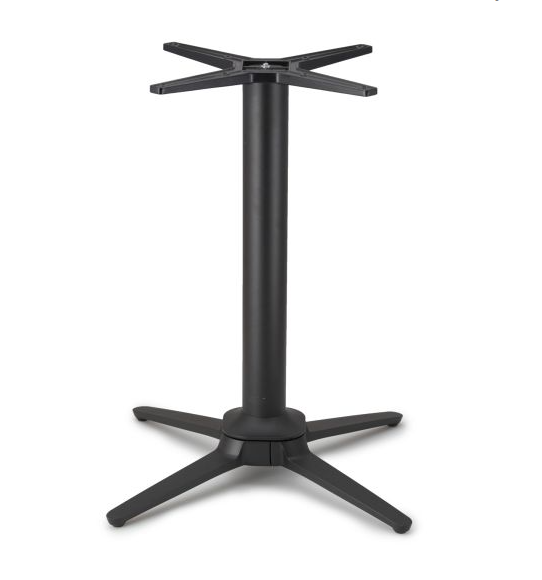
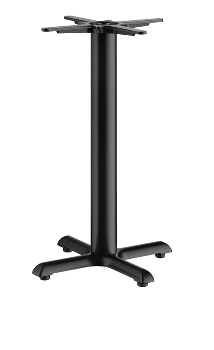

## Voice of the Customer Benchmarking Example

### Search #1

**Keywords:** "Self stabilizing table"

**Search Results Link:** [Search Link](https://www.google.com/search?q=Self+stabilizing+table&sca_esv=ffcf0adbfdee8899&udm=14&sxsrf=APpeQnucElEp7KMCV5AdGRwreOk7TzzLCw%3A1789455484231&ei=fOyoaqPaDZuzqtsPlqaz2AI&ved=2ahUKEwijiOqTgfCWAxWbmWoFHRbTDCsQ4dUDegQIBhAM&uact=5&oq=Self+stabilizing+table&gs_lp=Ehlnd3Mtd2l6LW1vZGVsZXNzLXdlYi1vbmx5IhZTZWxmIHN0YWJpbGl6aW5nIHRhYmxlMgsQABiABBiKBRiRAjIFEAAYgAQyBhAAGBYYHjIGEAAYFhgeMgYQABgWGB4yBhAAGBYYHjIGEAAYFhgeMggQABgWGB4YCjIGEAAYFhgeMgYQABgWGB5IwSFQAFi1HnAAeACQAQCYAcwBoAHPFaoBBjYuMTQuMrgBA8gBAPgBAZgCFqAC5xbCAgoQABiABBiKBRhDwgIOEAAYgAQYigUYsQMYgwHCAhEQABiABBiKBRiNBhixAxiDAcICCxAAGIAEGLEDGIMBwgIIEAAYgAQYsQPCAhAQABiABBiKBRhDGLEDGIMBwgINEAAYgAQYigUYQxixA8ICCBAAGIAEGJIDwgIIEAAYgAQYyQPCAgwQABiABBgKGAsYsQPCAg8QABiABBgKGAsYsQMYgwGYAwCSBwY1LjE1LjKgB8l_sgcGNS4xNS4yuAfnFsIHBDItMjLIB3OACAE&sclient=gws-wiz-modeless-web-only)

### Selected Products

#### 1. [Self-Stabilizing Black Table Base](https://tablebases.com/no-rock-esplanade-black-self-stabilizing-table-bases-1)

* Price: $359.99

* Vendor: Tablebases.com

* Description: The patented suspension mechanism is connected to four independent legs that move up and down to ensure no rocking. They are made from sturdy, light, weight aluminum, allowing use indoors or outdoors. 

##### Positive Comments

| Voice of the Customer                                                                                                                                                                  | Restated Customer Need                                                              |
| -------------------------------------------------------------------------------------------------------------------------------------------------------------------------------------- | ----------------------------------------------------------------------------------- |
| "“The table is a solid base. It looks great. No paint blemish's and easy to put together.”"                                                                                            | 1.  The table base provides a secure foundation (explicit)                          |
|                                                                                                                                                                                        | 2.  The table base has a professional appearance (explicit)                         |
|                                                                                                                                                                                        | 3.  The product can be assembled with minumum effort(explicit)                      |
|"The table base was perfect. Super high quality, heavy, and exactly as described. Assembly was very easy."                                                                              | 1.  The product is durable and built with quality materials (explicit)              |
|                                                                                                                                                                                        | 2.  The product matches its advertised specification (explicit)                     |
|                                                                                                                                                                                        | 3.  The assembly process is simple and intuitive (explicit)                         |
|"This counter height base was the exact height I was looking for...other sites offered bases that were an inch (or more) too short. Product was delivered quickly and in perfect condition. No screws are provided for attaching a custom table top but I already had suitable screws for my wood top so I didn't have to visit the hardware. My table looks great!"| 1. The product is available necessary dimensions (explicit)
|                                                                                                                                                                                        | 2. The product arrives promptly, without damage (latent)                            |
|                                                                                                                                                                                        | 3. The assembled table has a pleasant aesthetic (latent)                            |

##### Negative Comments

| Voice of the Customer                                                                                                                                                                                                                                                                                                                                                                                | Restated Customer Need                                  |
| ---------------------------------------------------------------------------------------------------------------------------------------------------------------------------------------------------------------------------------------------------------------------------------------------------------------------------------------------------------------------------------------------------- | ------------------------------------------------------- |
| "Table base was received on time, although the was pretty torn up. Luckily, the base was not damaged. I love the look of the base, but am a little disappointed in how it goes together. I found it tricky to get all of the parts to center properly, and regardless of how much I tightened the nuts, there is nothing to prevent the top from turning." | 1.  The components align easily during assembly (explicit)|
|                                                                                                                                                                                                                                                                                                                                                            | 2.  Product can be assembled without precise measurment (latent)|
|                                                                                                                                                                                                                                                                                                                                                            | 3.  The top remains securely position, without rotating (explicit)|
|"It would help to know how the leg attaches to the base. That information didn't appear to be listed. I'm guessing that, like most table bases, they are held together by a single screw. I was hoping for something more stable than a single screw. This is my first time trying your company and if this doesn't work, it will be lesson learned. This is for a university campus so we will see how it holds up."| 1. Clearly communicates assembly process(explicit)|
|                                                                                                                                                                                                                                                                                                                                                            | 2. The product provides a secure and stable connection between components(explicit)|
|                                                                                                                                                                                                                                                                                                                                                            | 3. The product maintains statbility under frequent usage (latent) |
|"The base I ordered came very quickly and it's a solid, heavy unit. My only comment would be that for stainless steel, it felt like there was not a lot of protective packaging. My base was fine but the boxes were in pretty rough shape by the time they came to me." | 1. Product is protected during shipping (explicit) |
|                                                                                                                                                                                                                                                                         | 2. Product arrives without cosmetic or structural damages (latent) |
|                                                                                                                                                                                                                                                                         | 3. Product provides a sturdy base (explicit) |

---

### Search #2

**Keywords:**"self stabilizing table base uneven floor"

**Search Results Link:** [Search Link](https://www.google.com/search?q=self+stabilizing+table+base+uneven+floor&sca_esv=6f3ccd550fd6cf18&sxsrf=APpeQnshCVmQ684XtGwKD3m0rWI3C26Ptw%3A1789495965013&ei=nYqpaoE86a-t9w-s4-b4DA&biw=2352&bih=1415&ved=2ahUKEwjB_sj6l_GWAxXpV-sIHayxGc8Q4dUDegQIBhAM&uact=5&oq=self+stabilizing+table+base+uneven+floor&gs_lp=Egxnd3Mtd2l6LXNlcnAiKHNlbGYgc3RhYmlsaXppbmcgdGFibGUgYmFzZSB1bmV2ZW4gZmxvb3IyDhAAGIAEGIoFGIYDGLADMg4QABiABBiKBRiGAxiwAzIIEAAY7wUYsAMyCxAAGIAEGKIEGLADMgsQABiABBiiBBiwA0iSBlAAWABwAXgAkAEAmAEAoAEAqgEAuAEDyAEAmAIBoAIEmAMAiAYBkAYFkgcBMaAHALIHALgHAMIHAzItMcgHA4AIAQ&sclient=gws-wiz-serp)

### Selected Products

#### 2. [FLAT Tech](https://www.bestbuy.com/product/dji-rs-5-combo-camera-stabilizer-black/JJ82LXXJ7L/sku/6671579?utm_source=feed&extStoreId=&ref=212&loc=20155919705&gclsrc=aw.ds&gad_source=4&gad_campaignid=20151703182&gbraid=0AAAAAD-ORIhUQALzbB9tjXYsE8U8xogyM&gclid=CjwKCAjw2aPVBhBkEiwA0Cptt7v702bAhG6wDLJbHVZMJQj5xr1uiuq7cmhCcUGRcF-GIwsVZmvK9xoCQlcQAvD_BwE)

* Price: $121.00

* Vendor: WebstaurantStore

* Description: Capable of adapting to uneven flooring, the FLAT Tech CT2007 22” x 22” auto adjustable table base brings unmatched leveling abilities to your restaurant, diner, or coffee shop. This product is designed to automatically adjust to changes in the floor whenever it’s moved, so you can rearrange your dining room without worrying about your tables sitting unevenly. Additionally, this FLAT Tech table base is crafted from cast iron with a textured black finish that offers a classic look in any business.

#### Positive Comments
| **Voice of the Customer**                                                                                                                                                                  | **Restated Customer Need**                                                                |
|----------------------------------------------------------------------------------------------------------------------------------------------------------------------------------------|---------------------------------------------------------------------------------------|
|"These table bases work! We are in an old refurbished building, so our floors are very uneven. We had thick oak tabletops made and installed these bases ourselves. They are very sturdy and the tables do not rock. Absolutely recommend!"| 1. The product maintains stability on uneven surfaces (explicit)|
|                                                                                                                                                                                                                                           | 2. The product provides a sturdy foundation for a table top (explicit)|
|                                                                                                                                                                                                                                           | 3. The product can be installed without professional assistance (latent)|
|"These really work! Not a wobbly table in our 100 year old building. One thing I will note is that in the self-leveling process sometimes it means that tables adjacent to one another are not exactly level with each other (they'll be level but one will be higher or lower) but they likely wouldn't be with standard bases anyway since the real problem is the floor they're standing on. Well worth the investment."| 1. The product prevents table wobble during use (explicit)|
|                                                                                                                                                                                                                                           | 2. The product operates efficiently on irregular flooring conditions (explicit)|
|                                                                                                                                                                                                                                           | 3. The product maintains a consistent, level height (latent)|
|"YOU HAVE GOT TO GET THESE!!! OMG these are amazing. No more folded napkins to get the table to sit level. I am so in love with these its ridiculous."                                                                                     | 1. The product maintains a level support without the need for additional supports (explicit)|
|                                                                                                                                                                                                                                           | 2. The product requires minimal user input to mainatain stability (latent)|
|                                                                                                                                                                                                                                           | 3. The product provides a convenient method of accomodating uneneven floors (latent)|

#### Negative Comments
| **Voice of the Customer**                                                                                                                                                                  | **Restated Customer Need**                                                                |
|----------------------------------------------------------------------------------------------------------------------------------------------------------------------------------------|---------------------------------------------------------------------------------------|
|"I purchased this table base last summer in the hopes of eliminating the need to have to bend down between guests to stop the table from wobbling. Unfortunately it was too good to be true. The table leans to whichever side a customer puts his hand or arm down, effectively creating a see-saw effect."| 1. The product remains stable when weight is placed on one side (explicit)|
|                                                                                                                                                                                                                                                                                                            | 2. The product maintains stability when load is applied variably (explicit)|
|                                                                                                                                                                                                                                                                                                            | 3. The product performs consistently with its advertised capabilities (latent|)
|"For the price difference between these legs and standard table legs, you would expect the tables to balance like the video shows, but they don't. They make it look like it automatically balances as the floor level changes, but you have to push on the edges of the tables to get the table to level out and the second someone puts any weight on their side of the table, it's off until someone pushes on the other side."| 1. The product automatically reaches its stabilized position after being moved (explicit)|
|                                                                                                                                                                                                                                                                                                            | 2. The product remains stable when load is applied (explicit)|
|                                                                                                                                                                                                                                                                                                            | 3. The stabilization systems accomodates loads from all side (latent)|
|"These really work! Not a wobbly table in our 100 year old building. One thing I will note is that in the self-leveling process sometimes it means that tables adjacent to one another are not exactly level with each other (they'll be level but one will be higher or lower) but they likely wouldn't be with standard bases anyway since the real problem is the floor they're standing on. Well worth the investment."| 1. The product can maintain a consistent height with surrounding surfaces (explicit)|
|                                                                                                                                                                                                                                                                                                            | 2. Multiple surfaces can be positioned together for a flat surface (latent)|
|                                                                                                                                                                                                                                                                                                            | 3. Stabilization process does not interfere with table arrangement (latent)|

---

### Search #4

**Keywords:**"self balancing base"

**Search Results Link:** [Search Link] https://www.google.com/search?q=self+balancing+base+&sca_esv=672a25f6bc86d272&biw=1047&bih=532&sxsrf=APpeQnu0y1OH_jjLHHx3b2XwVv2o79d2cw%3A1789539648241&ei=QDWqapyoDpzNkPIP69C6sQ8&uact=5&oq=self+balancing+base+&gs_lp=Egxnd3Mtd2l6LXNlcnAiFHNlbGYgYmFsYW5jaW5nIGJhc2UgMgQQIxgnMgYQABgWGB4yBhAAGBYYHjILEAAYgAQYigUYhgMyCBAAGIAEGKIEMgUQABjvBTIFEAAY7wUyBRAAGO8FSNcLUIgDWIgDcAF4AZABAJgBXaABXaoBATG4AQPIAQD4AQGYAgKgAmPCAgoQABhHGNYEGLADmAMAiAYBkAYIkgcBMqAH0QWyBwExuAdgwgcDMC4yyAcEgAgB&sclient=gws-wiz-serp 

### Selected Products

#### 2. [Segway Ninebot S2 Electric Self-Balancing Scooter] (https://store.segway.com/ninebot-s2?utm_source=google&utm_medium=pmax&utm_campaignid=17209955658&gad_source=4&gad_campaignid=17209975344&gbraid=0AAAAABqJF-1azKaMePy4NnRchV_iiGukW&gclid=CjwKCAjw2aPVBhBkEiwA0Cpttzp5xPkTFKvNrSdHg1Uy881yemSkkta5xv2sHPHzIrEaxVeqwS0LnxoCnhYQAvD_BwE)

* Price: $649.99

* Vendor: TuvRheinland

* Description: The Ninebot S2 is a premium self-balancing scooter designed for smooth, stable, and stylish rides. Perfect for both teens and adults, it features an adjustable knee control bar for a customized fit, ensuring maximum comfort and control. Personalize your experience with RGB wheel lights and taillights, plus enjoy music on the go with the built-in Bluetooth speaker. The Ninebot S2 is the ultimate blend of style, comfort, and technology.

#### Positive Comments
| **Voice of the Customer**                                                                                                                                                                  | **Restated Customer Need**                                                                |
|----------------------------------------------------------------------------------------------------------------------------------------------------------------------------------------|---------------------------------------------------------------------------------------|
|"Having medical issues with my legs, the Ninebot allows me to be much more active around the yard. The Ninebot is well worth the money for the technology and name that supports the device. I am currently 66 and do not have a problem enjoying this device. Thank You. . . ."| 1. The product is helpful for people with diasbilities (explicit)|
|                                                                                                                                                                                                                                           | 2. The product provided a lot of stability(explicit)|
|                                                                                                                                                                                                                                           | 3. The product is user friendly (latent)|
|"The NineBot S2 is perfect for our use. We use 2 earlier models here on the ranch and just bought 2 more for grandsons to use at college. Parking is a pain and these solve that problem. QUESTION: How and what type of lock do you recommend on campus with a bike rack? Can a U lock go through the frame anywhere on the S2?"| 1. The product was built was highly reliblity (explicit)|
|                                                                                                                                                                                                                                           | 2. The product can handle very bumpy roads (latent)|
|                                                                                                                                                                                                                                           | 3. The product can be used by many ages (latent)|
|"I try to half price competitor with a hover board and it was cheap, and flimsy, and I ended up returning it. Then I discovered Segway and this is leaps and bounds better than any other knock off at a very favorable price point. I’m extremely happy with my purchase and I’m glad I decided to go with Segway rather than an off brand. Segway makes quality products and you will know the difference and it’s well worth the extra money"                                                                                     | 1. The product is worth more money if it shows reliabiltyexplicit)|
|                                                                                                                                                                                                                                           | 2. The product was stabile (latent)|
|                                                                                                                                                                                                                                           | 3. The products was easy to use (latent)|

#### Negative Comments
| **Voice of the Customer**                                                                                                                                                                  | **Restated Customer Need**                                                                |
|----------------------------------------------------------------------------------------------------------------------------------------------------------------------------------------|---------------------------------------------------------------------------------------|
|"This is a piece of junk. I can’t even charge. I can’t even turn them off. It was a piece of junk. You guys sell me"| 1. The product needs to have a good battery life (explicit)|
|                                                                                                                                                                                                                                                                                                            | 2. The products needs to be easy to trouble shoot(explicit)|
|                                                                                                                                                                                                                                                                                                            | 3. The product was not very good(explicit)|
|"Something internally in the mechanism that controls turning broke within a few hours of riding"| 1. The product should last longer than a few hours (explicit)|
|                                                                                                                                                                                                                                                                                                            | 2. The product should be easy to troubleshoot (explicit)|
|                                                                                                                                                                                                                                                                                                            | 3. There should be a testing period before shipping (latent)|
|"I’ve been trying for 3 weeks to return 2 scooters that were ordered by mistake. The same day I placed the order because I had thought I had ordered 3 and only one came in the day before, the other 2 were delivered. I tried to call and cancel the new order and they were closed so I emailed requesting cancellation. Called at 6 am on Monday and was told email was received for cancellation. Then Monday afternoon I get notification the order has shipped for the 2 I had cancelled. You can never get a person from America to converse with it’s all by email and with foreigners that don’t understand. It is very frustrating I will NEVER order from Segway again. My grandkids love their scooters but I would suggest buying from Amazon they are much easier to deal with."| 1. The product is very unreliable after cyclical action (explicit)|
|                                                                                                                                                                                                                                                                                                            | 2. The product needs a more reliable ealier on(latent)|
|                                                                                                                                                                                                                                                                                                            | 3. The product should not break with such little use (latent)|

---

---

#### 5. Next Product goes here

## Organized Need Statements

### First Placement

### Grouped with categories

### Ranked

## Compiled list of user Needs

1. The device will...
1. The device is ...
1. The device can ...
100. The device is...
