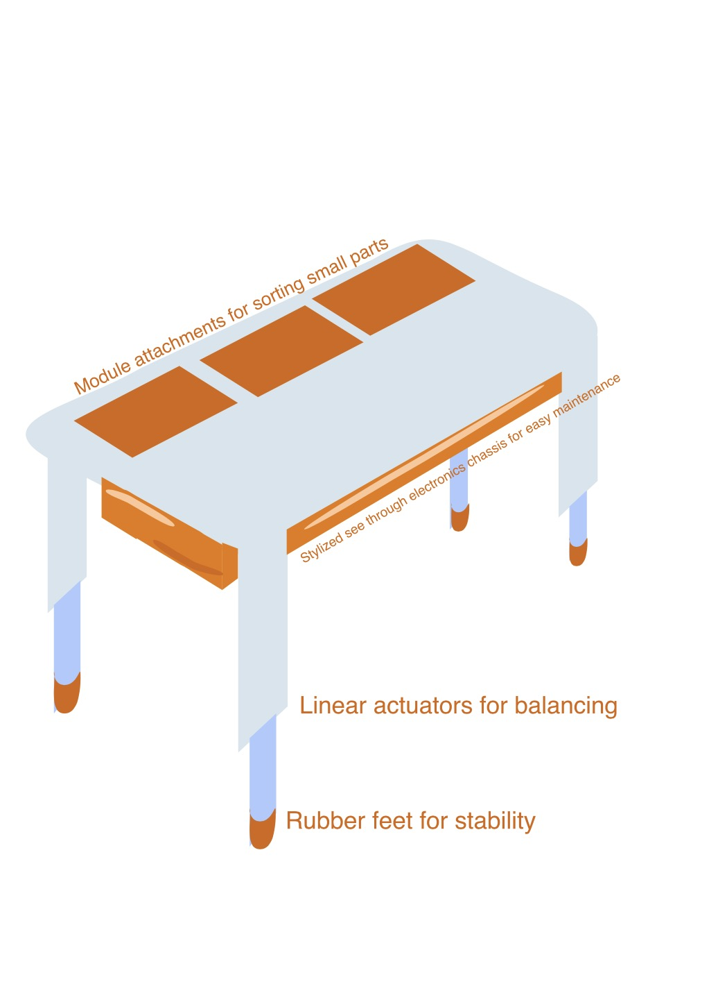
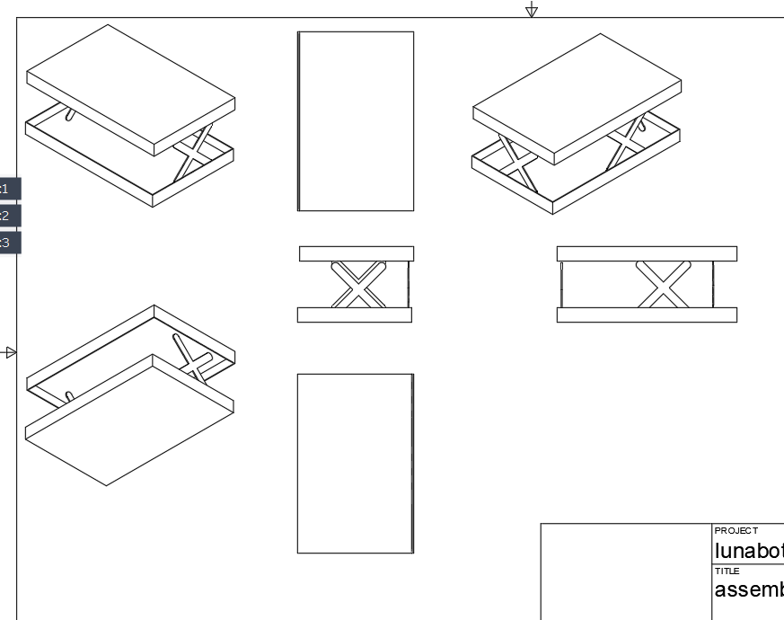
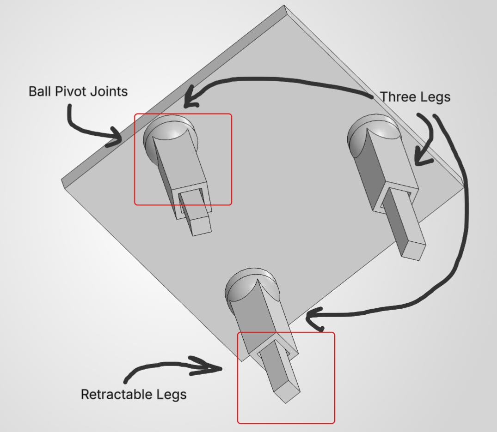

## Intro/overview

In order to produce possible designs for the project, the compiled list of user needs will be used as a baseline for the generation
of relevant features. Our team will brainstorm together, listing possible features for each user need, ranked by importance, in
order to determine as many solutions as possible. These solutions will then be analyzed and organized into categories that could
become the final product.

## Generating Ideas

For each user need and product requirement, brainstorm 5 different product features that could be used to satisfy that requirement.

|                   requirement / need | feature | detail                                                                      |
| :----------------------------------- | :----- | --------------------------------------------------------------------------- |
|Maintains a level horizon through dynamic movements           | springs  | dampen oscillations from vibrations, keeping surface level |
|Maintains a level horizon through dynamic movements           | padding | absorb vibrations through padded material          |
|Maintains a level horizon through dynamic movements           | adjustable legs | legs adjust according to reaction|
|Maintains a level horizon through dynamic movements           | dampers| prevent sudden motions|
|Maintains a level horizon through dynamic movements           | gimbal | correct vibration|
|Product provides a sturdy foundation                          | bolts | bolt down base to keep stationary |
|Product provides a sturdy foundation                          | wide base | weight is distributed over a larger area|
|Product provides a sturdy foundation                          | braces | reinforced base to reduce bending |
|Product provides a sturdy foundation                          | rubber feet | increases grip with the surface beneath |
|Product provides a sturdy foundation                          | heavy weight | harder to move with greater weight |
|Maintains stability under frequent use                | bearings | reduces friction between joints |
|Maintains stability under frequent use                | shock absorbers | reduce wear from force applied to structure
|Maintains stability under frequent use                | locking fasteners | prevents screws and connections from coming loose over time |
|Maintains stability under frequent use                | washers | distributes force around fasteners |
|Maintains stability under frequent use                | lubrication | reduces friction of moving parts |
|The product remains stable when weight is placed on one side  | pressure sensor | detects difference of weight on the surface |
|The product remains stable when weight is placed on one side  | counterweight | weight is shifted depending on the difference of force |
|The product remains stable when weight is placed on one side  | accelerometer | measure how the fast the surface is accelerating |
|The product remains stable when weight is placed on one side  | pivot joint | surface is able to correct changes in orientation |
|The product remains stable when weight is placed on one side  | pulley | counteracts weight by redistributing force |
|The product requires minimal user input to maintain stability | motor control | motors actuate response
|The product requires minimal user input to maintain stability | bluetooth | wireless control from another device
|The product requires minimal user input to maintain stability | distance sensor | sense changes of distance from the ground
|The product requires minimal user input to maintain stability | control system | automatic leveling control system for level surface |
|The product requires minimal user input to maintain stability | screen | user can input configuration through an accessible interface |
|Product is durable | metal gears | withstand repeated motor movement |
|Product is durable | enclosure | protects internal electronics/structure from outside factors
|Product is durable | steel frame | strong material to support the product |
|Product is durable | support beams | support the structure of the product, providing stronger base |
|Product is durable | fuse | reduces likelyhood of electrical failure |
|Table base has a professional/sleek appearance | wire covers | hides exposed wiring |
|Table base has a professional/sleek appearance | rounded corners | finished look without sharp edges |
|Table base has a professional/sleek appearance | indicator LEDs | displays technological detail |
|Table base has a professional/sleek appearance | motor covers | conceals mechanical components |
|Table base has a professional/sleek appearance | finished paint | solid color provides aesthetic |
| Product maintains stability and performance over time | maintenance alerts | warns the user when components need inspection or service |
| Product maintains stability and performance over time | spare parts included | comes with commonly needed replacement parts |
| Product maintains stability and performance over time | high-quality hydraulic components | durable hydraulics reduce wear and maintain performance |
| Product maintains stability and performance over time | adaptive learning system | learns movements to reduce unnecessary mechanical stress |
| Product maintains stability and performance over time | responsive customer service | provides direct support for troubleshooting and repairs |
| The product provides a lot of stability | capstan joint | provides strong, controlled movement for precise adjustments |
| The product provides a lot of stability | high-friction rubber feet | increases grip on smooth surfaces to prevent sliding |
| The product provides a lot of stability | high-sensitivity sensors | detects small changes in orientation to correct quickly |
| The product provides a lot of stability | wide, low-profile base | lowers the center of gravity to resist tipping |
| The product provides a lot of stability | ball-joint feet | conforms to uneven surfaces while maintaining contact |
| The product provides a lot of stability | independent leveling | each leg adjusts independently to compensate for terrain |
| The product provides a lot of stability | magnetic locking system | secures legs or wheels once desired position is reached |
| The product can handle very bumpy roads | suspension in each leg | absorbs shocks and reduces vibrations transferred to top |
| The product can handle very bumpy roads | spring-loaded telescoping legs | provides vertical movement to absorb sudden terrain changes |
| The product can handle very bumpy roads | shock absorbers | reduces large impacts between tabletop and chassis |
| The product can handle very bumpy roads | emergency stabilization mode | lowers table closer to ground when severe instability occurs |
| The product can handle very bumpy roads | predictive stabilization | detects movement changes to adjust before tipping happens |
| The product can handle very bumpy roads | battery stabilization reserve | dedicated battery reserve maintains power if primary fails |
| The product can handle very bumpy roads | vibration isolation | mounts isolate high-frequency vibrations from payload |
| The aesthetic quality holds up well over long-term use | scratch-resistant coating | prevents scratches and visible surface wear |
| The aesthetic quality holds up well over long-term use | chemical-resistant coating | protects surface from spills and cleaning chemicals |
| The aesthetic quality holds up well over long-term use | rounded, organic edges | reduces visible impact damage while giving a modern look |
| The aesthetic quality holds up well over long-term use | modular tabletop panels | allows tabletop to be removed, replaced, or customized |
| The aesthetic quality holds up well over long-term use | interchangeable functional tabletop | allows swapping for specialized surfaces like silicone mats |
| The aesthetic quality holds up well over long-term use | hidden fasteners | conceals screws to create a cleaner, wear-resistant look |
| The aesthetic quality holds up well over long-term use | transparent maintenance panel | clear underside section showcases internal robotics |
| The product can be used by many ages | single-button operation | single primary button allows simple one-touch activation |
| The product can be used by many ages | pinch protection | sensors prevent moving legs from pinching fingers |
| The product can be used by many ages | intuitive controls | simple symbols and clear feedback eliminate user confusion |
| The product can be used by many ages | voice control | voice commands allow hands-free operation for all users |
| The product can be used by many ages | manual override | allows physical repositioning if power is unavailable |
| The product can be used by many ages | automatic height adjustment | adapts height to accommodate different users or seating |
| The product can be used by many ages | mechanical backup system | mechanical lock holds position if electrical power drops |
| The product can be used by many ages | terrain-learning software | remembers frequent surfaces to improve stabilization response |
| Hydraulic self-leveling feet remain completely sealed without leaking fluid | dry mechanical lead-screws | uses gear drives to eliminate liquid hydraulic fluids |
| Hydraulic self-leveling feet remain completely sealed without leaking fluid | double o-ring shaft seals | prevents internal fluid escape under heavy loads |
| Hydraulic self-leveling feet remain completely sealed without leaking fluid | magnetic coupling drives | transfers motor power through sealed wall without penetrations |
| Hydraulic self-leveling feet remain completely sealed without leaking fluid | self-lubricating polymer bushings | operates smoothly without needing liquid grease or oil |
| Hydraulic self-leveling feet remain completely sealed without leaking fluid | bellows dust boots | seals moving joints from external dust and fluid degradation |
| Prevents scratching or marring delicate floor surfaces | non-marking polyurethane caps | soft foot pads protect hardwood and tile surfaces |
| Prevents scratching or marring delicate floor surfaces | felt glide pads | smooth felt bottom prevents scuffing during table movement |
| Prevents scratching or marring delicate floor surfaces | recessed rubber pad inserts | keeps metal base from touching floor directly |
| Prevents scratching or marring delicate floor surfaces | nylon swivel glides | low-friction plastic pads slide smoothly across floors |
| Prevents scratching or marring delicate floor surfaces | protective silicone boots | encases foot pads in soft rubber to safeguard floors |
| Product includes all required accessories in the package | all-in-one accessory bundle | includes all core tools and mounts out of the box |
| Product includes all required accessories in the package | integrated focus motor mount | includes dedicated bracket for auxiliary motor drive |
| Product includes all required accessories in the package | wireless transmitter dock | built-in receiver bay holds video transmitter gear |
| Product includes all required accessories in the package | standardized charging cable | includes dedicated wall adapter and fast-charge cable |
| Product includes all required accessories in the package | hard-shell storage case | custom foam case protects all accessories during transport |
| Product allows rapid, effortless balancing of mounted payloads | fine-tuning adjustment knobs | lead-screws allow precise micro-millimeter positioning |
| Product allows rapid, effortless balancing of mounted payloads | quick-release mounting plate | lever mechanism allows instant payload detachment |
| Product allows rapid, effortless balancing of mounted payloads | teflon-coated guide rails | smooth rails reduce friction during slide balancing |
| Product allows rapid, effortless balancing of mounted payloads | axis position memory marks | laser-engraved rulers help restore balance settings fast |
| Product allows rapid, effortless balancing of mounted payloads | automated motor calibration | auto-tunes motor power to match attached payload inertia |
| Device provides dedicated physical controls for rapid mode switching | 3-stage hardware slider switch | physical switch toggles between Pan, Lock, and Follow modes |
| Device provides dedicated physical controls for rapid mode switching | customizable trigger button | index-finger trigger re-centers or speeds up response |
| Device provides dedicated physical controls for rapid mode switching | front dial controller | assignable rotary wheel changes focus or motor speeds |
| Device provides dedicated physical controls for rapid mode switching | touchscreen shortcut menu | swipeable panel provides 1-tap access to frequent modes |
| Device provides dedicated physical controls for rapid mode switching | haptic feedback motor | vibrates base to confirm mode toggles without visual checks |
| System automatically secures moving joints during transport | motorized automated axis locks | locks freeze axes automatically when powered off |
| System automatically secures moving joints during transport | mechanical latch pins | spring pins keep folding legs firmly locked during carry |
| System automatically secures moving joints during transport | soft rubber bump stops | cushions contact points between folded mechanical arms |
| System automatically secures moving joints during transport | magnetic arm retention | magnets hold folded components flush against the frame |
| System automatically secures moving joints during transport | travel-lock toggle lever | single lever locks all rotating joints for transport |
| System automatically secures moving joints during transport | spring-loaded latching pin | secures telescoping joints automatically when fully collapsed |

## Step Three

Thematic Grouping, Ranking, and Feature Rationale

| Theme / Category | Top Ranked Feature | Value (1-5) | Feasibility (1-5) | Score | Rationale for Top Selection |
| :--- | :--- | :---: | :---: | :---: | :--- |
| Theme 1: Core Mechanical Stability | Dry Mechanical Lead-Screws | 5 | 5 | 25 | Eliminates fluid leak risks on delicate floors entirely while providing highest static load support |
| Theme 1: Core Mechanical Stability | Independent Leveling Legs | 5 | 5 | 25 | Directly compensates for uneven ground variations without creating structural torsion across frame |
| Theme 1: Core Mechanical Stability | Shock Absorbers & Dampers | 5 | 5 | 25 | Passively dissipates sharp impact energy before it triggers unnecessary active motor corrections |
| Theme 2: Sensing & Control Systems | Accelerometer + Pressure Sensor Fusion | 5 | 4 | 20 | Prevents system hunting by distinguishing between side load placement and dynamic ground vibration |
| Theme 2: Sensing & Control Systems | Predictive Stabilization | 5 | 4 | 20 | Actuates leg motors upon detecting tilt acceleration before actual physical tipping occurs |
| Theme 2: Sensing & Control Systems | Closed-Loop PID Controller | 5 | 4 | 20 | Continuously calculates positional error to drive actuators smoothly to precise zero-plane horizon |
| Theme 3: User Interface & Safety | Optical Pinch Protection | 5 | 5 | 25 | Critical safety mechanism that instantly halts leg actuation if fingers or objects enter joints |
| Theme 3: User Interface & Safety | 3-Stage Hardware Slider Switch | 5 | 4 | 20 | Offers immediate, zero-latency physical state switching (Auto / Lock / Off) without menu navigation |
| Theme 3: User Interface & Safety | Single-Button Primary Activation | 4 | 5 | 20 | Ensures low technical barrier to entry for everyday users to zero and initialize table base |
| Theme 4: Surface Protection & Aesthetics | Non-Marking Polyurethane Caps | 5 | 5 | 25 | Provides maximum friction coefficient on polished surfaces without leaving visible scuff marks |
| Theme 4: Surface Protection & Aesthetics | Hidden Fasteners | 4 | 5 | 20 | Delivers clean aesthetic visual profile while shielding connection hardware from dust and liquid spills |
| Theme 4: Surface Protection & Aesthetics | Scratch & Chemical Coating | 4 | 4 | 16 | Ensures long-term visual durability under harsh cleaning protocols and repeated outdoor use |
| Theme 5: Transport, Storage & Modularity | Motorized Automated Axis Locks | 4 | 4 | 16 | Freezes moving linkages automatically on power-off to isolate motor gears from transit impact loads |
| Theme 5: Transport, Storage & Modularity | Quick-Release Mounting Plate | 5 | 4 | 20 | Enables rapid toolless separation of tabletop surface from support column for transport |
| Theme 5: Transport, Storage & Modularity | Travel-Lock Toggle Lever | 4 | 5 | 20 | Mechanically locks folded leg assemblies flush against central column with single motion |

Product Concepts

| Subsystem / Feature Category | Concept 1: Tripod Retractable Base | Concept 2: Heavy-Duty Hydraulic Table | Concept 3: Portable Emergency Response Table |
| :--- | :--- | :--- | :--- |
| Primary Design Philosophy | Minimalist 3-point geometry offering fast self-leveling on uneven surfaces with fully retractable legs for space-saving storage | Maximum payload capacity and industrial durability using high-force hydraulic actuators for dynamic commercial environments | Rapid field deployment, extreme weather/terrain resilience, and easy sanitization for crisis medical and tactical operations |
| Frame & Base Geometry | 3-leg tripod arrangement with square-post telescoping shafts and ball pivot joints on all leg ends | Thick-walled reinforced steel frame with wide gusseted base plate and structural support beams | High-strength folding aluminum/carbon-fiber chassis with quick-deploy scissor linkages |
| Drive & Leveling Actuation | Micro-planetary gearmotors driving dry mechanical lead-screws inside retractable leg housings | Sealed fluid-driven hydraulic piston actuators powered by a compact high-pressure electric pump | High-speed electric linear actuators with independent spring-loaded telescoping leg extensions |
| Sensing & Control Systems | High-sensitivity orientation sensors calculating 3-point geometric plane zeroing | Pressure sensor + accelerometer fusion driving closed-loop hydraulic PID metering valves | Predictive stabilization software with terrain-learning auto-zeroing algorithms |
| User Interface & Controls | Single-button primary zeroing switch with manual twist-lock override dials | 3-stage hardware slider switch with integrated maintenance alert diagnostic LEDs | Sealed high-contrast touchscreen shortcut menu with tactile physical override trigger button |
| Safety & Surface Protection | Ball-joint feet with non-marking polyurethane caps and optical leg pinch protection sensors | Double O-ring shaft seals, bellows dust boots, and heavy recessed rubber shock-absorbing pads | High-friction rubber feet with chemical-resistant antimicrobial protective coating |
| Transport & Storage Locks | Retractable leg assemblies that collapse flush into central column with single travel-lock toggle | Motorized automated axis locks with heavy steel mechanical latch pins | Custom hard-shell storage case with quick-release mounting plate and magnetic arm retention |
| Selected Hybrid Innovation | Tri-Axis Gyro-Damped Swivel Foot | Self-Sealing Magnetic Quick-Dock | Smart LED Safety Edge Ring (for low-light night field ops) |

## Step Four

## Step 5

#### Team Design Ideation

In our brainstorming session, each of us made sure that we were open to all ideas, opinions, and perspectives to make sure that all possible solutions would be acknowledged. The participants of the brainstorming consisted of Joseph Nunez, Caden Laughlin, and Emma Cumiford. We met in a Discord call using a Canva document to separate user needs, features, and their correlating groupings in a visual manner using sticky notes. This approach was beneficial as our team could, in real time, identify which user needs fit a logical grouping and find which ones connected the best, forming possible features. Each of us would say an idea out loud and the others would share their opinion and possible details regarding the feature’s relevance to the user’s need. This would keep ideas fresh while allowing us to build from each other’s ideas.

We took information from the user’s needs and benchmarking assignment and the team organization assignment as we had to evaluate the audience and target goal that our product would need to meet. In conducting the user needs and benchmarking assignment, we found that the target audience online was more drawn towards the restaurant, film, health, military, and marine industries when it came to self-stabilizing tables or platforms. These discoveries allowed us to further refine our ideation process and develop the classes of features into more distinct categories. 

To generate ideas, we used the internet and the articles provided so that we could follow a structured brainstorming approach. Using the internet, our team was able to find different perspectives on the products that we had researched during the user needs and benchmarking assignment, gaining perspective into possible solutions that others needed. Furthermore, we used the internet to see features implemented into similar products that we could possibly incorporate in our own way by comparing them with our own ideas.

Features were partitioned into the groups of Service, Appearance, Performance, Assembly, Control, and Rigidity. These groups were chosen because they appeared the most in user feedback on the product adjacent to our project. Users constantly leave reviews on these topics, either complimenting or complaining about shipping times, ease of assembly, durability, or user input. Since these were the most common, we believed that they deserved their own categories for the brainstorming process. By grouping them into these categories, we were, more effectively, able to compare ideas with each other and create possible features into a product.

Ideas were ranked based on the audience we were targeting, the prevalence of a complaint or need vocalized by customers, and the feasibility of being able to accomplish each feature. Finally, we synthesized possible aligning features together to form products that could achieve the main goal of a self-stabilizing table.
