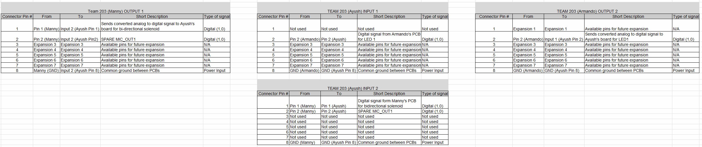

## Introduction
The team block diagram demonstrates how each PIC Curiosity Nano micocontroller will take in analog signals, filter them, and process them through specific input pins, and which pins will output to analog devices or digital pins. Finally the diagram shows how we will communicate across microcontrollers using the 8 pin ribbon connectors.  
 
## Final Iteration
Below is our finalized team block diagram. The components listed reflect the parts we planned to use for our design, but due to ordering delays and sudden unexpected changes in manufacturing, some were not able to arrive on time and had to be changed for alternative parts.

<object data="https://egr304-203.github.io/sparkguard/Team203BlockDiagramFinal.pdf" type="application/pdf" width="700px" height="700px">
    <embed src="https://egr304-203.github.io/sparkguard/Team203BlockDiagramFinal.pdf">
        
This browser does not support PDFs. Please download the PDF to view it: <a href="https://egr304-203.github.io/sparkguard/Team203BlockDiagramFinal.pdf">Download PDF</a>.

    </embed>
</object>  

**Notes from this iteration:** 
1. All boards send/receive some sort of communication 
2. Functionality is simplified and aligns with updated design direction. 
3. Current sensor was added to meet power calculation requirements with a constant voltage. 
4. Updated microphone sensor path with individual diagram details 
5. Corrected format errors from previous diagram. 

### Team Connectors

Attached [here](TeamConnectorsFinal.xlsx) is a link to the above excel sheet we developed with further details on the 8 pin connections between subsystems shown on our latest block diagram.

## Decision making process
We structured our block diagram to accurately show the inputs and outputs of our boards, which pins are being used, and what type of communication we are using between boards.

The result of this is three separate boards each with female 8 pin connectors that are all going to be connected together. "Connector 1" represents an input connector "Connector 2" represents an output connector.

The block diagram meets the product requirements because it features the new emphasized product features including: security/safety with the solenoid and microphone, the sensor/display to show power consumption, and the fact that the entire device is contained with these components means it is not reliant on external apps, eliminating connectivity issues.