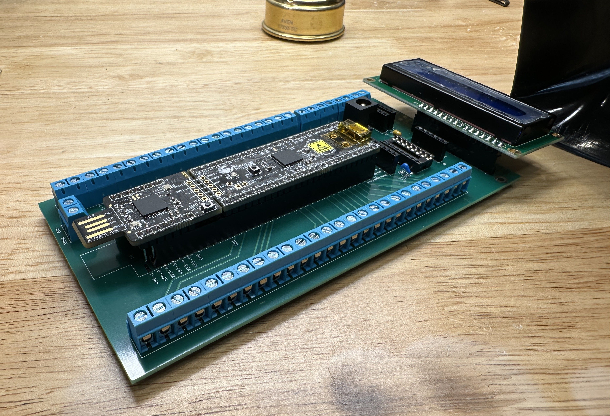
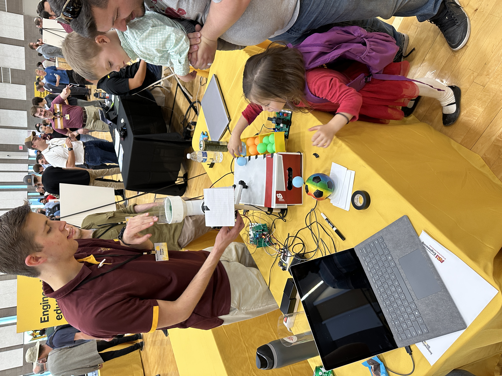

## Introduction

**Bold Text**
_Italic Text_
**_Bold and Italic Text_**

## Team Block Diagram, Process Diagram, and Message Structure
[Team_Block_Diagram](https://app.diagrams.net/#G1Mv4OLmAqWyhrVXr4TWVB89evNlQIgr9X#%7B%22pageId%22%3A%22DuODgdJueQHADXTg6JkB%22%7D)

## Research Question

* Bullet Point 1
* Bullet Point 2
* Bullet Point 3

## Images

  
**Figure 2:** Here is a picture of an image linked on the internet

{style="width:350px;"}  
**Figure 2:** Here is a picture from the image folder on my local site, with css formatting to make it smaller

<!-- 
  
**Figure 3:** Innovation Showcase Spring '25, where the products were a STEM-themed display that demonstrates a single scientific/engineering concept with the intended user of K-12 students interested in learning about science, technology, engineering, or math. -->

## Results

1. Numbered Point 1
1. Numbered Point 2
1. Numbered Point 3

## Conclusions and Future Work

## External Links

[example link to idealab](https://idealab.asu.edu)

## Results

1. Numbered Point 1
1. Numbered Point 2
1. Numbered Point 3

## Conclusions and Future Work

## External Links

[example link to idealab](https://idealab.asu.edu)

## References

